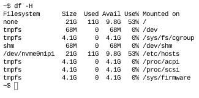
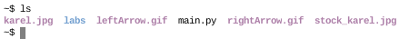
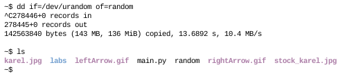
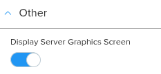
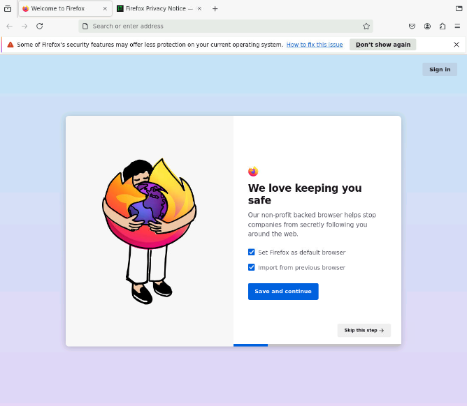

# Hacking CodeHS using Python
A *VERY* simple guide on how to exploit CodeHS's output console 

Today, we will be tricking the codehs.com code editor into giving us access to the kernel and running graphical programs. This process only takes a very miniscule understanding of Python, a decent understanding of Linux and Bash prgrams (like `wget` and `tar`), a CodeHS account, and the willingness to go against the EXTREMELY low FPS rate.

#### NOTE: I do NOT permit the use of this to get around school or work restrictions. I am not responsible if anything happens to you or your peers. Run all commands and programs cautiously.

## Getting started
You will start by making a simple program that gives you access to the kernel using Bash. Go to CodeHS. Create your program.  Type this into your code editor:

```
import os

os.system('bash')
```

As you can see it is not at all comlplicated, as it only takes two lines of code without spaces. It'll only get easier from here!

### Play around some

Do some simple Bash programs to get used to the enviorment. For example:

#### df -H

#### ls

#### dd if=/dev/urandom of=...

## Graphical Programs
Lets learn how to run graphical programs, using Firefox as an example

#### NOTE: from now on, you must have the "Display Server Graphics Screen" (in the Other section of setting) option ON. I recommend making a "PyGame" project instead of a regular "Python" project and erasing all the text in the code editor, since "PyGame" has the Graphics Screen on by Default


Put the following code into the code editor (or download the [examples/firefox.py](examples/firefox.py) file and uploading it to the code editor):
```
import os 

os.system('''wget https://ftp.mozilla.org/pub/firefox/releases/131.0b9/linux-x86_64/en-US/firefox-131.0b9.tar.bz2
tar -xvf firefox-131.0b9.tar.bz2
cd firefox
./firefox
''')
```
Run the program, wait about ~30 seconds, and you should see a Firefox window pop up. 


(By the way, if you were trying to use this to bypass some type of YouTube or Reddit block, don't, there is no sound and YouTube doesn't work since the OS is so unstable)

### Let's break our code down
`wget https://ftp.mozilla.org/pub/firefox/releases/131.0b9/linux-x86_64/en-US/firefox-131.0b9.tar.bz2` gets the latest version of Firefox and saves it to our `/home/karel` directory

`tar -xvf firefox-131.0b9.tar.bz2` "unzips" our file into the new `/home/karel/firefox` directory

`cd firefox` goes into the Firefox directory

`./firefox` runs Firefox

Most graphical programs run on CodeHS should look similar to this, since we have no access to the package manager `apt` (no root access).

### Play around some
Search some websites up. Maybe even look at all of the files that make up CodeHS that you've never seen before. For example:
#### andy.png (located in /home/karel/labs/stenography/)

#### stock_karel.jpg (located in /home/karel)

#### python3.12-setup.sh (located in /, READ-ONLY)


### More examples
If you want more examples of graphical programs you can run on CodeHS, check out the [examples](examples) folder. If you go to there, you may see that I got Minecraft to work. I don't recommend using it. I have no idea where the password and email data goes (probably nowhere, but still), its laggy as HECK (2 FPS on average), and you can barely look up or down, you have to enable like 5 
settings to SOMEWHAT fix it. But PyCharm works fine though. Also, I had a DOOM 2 program, but I dont know the legality of distributing .WAD files, so PLEASE let me know if I should add it or not.

## Bonus: Hugging Chat AI
This is just a bonus program I threw in here, about how to access generative AI in the ouput console using the hugcat module.  

#### NOTE: You need a Hugging Face account. Go to https://huggingface.co to register

First off, download and install the module using the OS module
```
import os

os.system("pip install hugchat && clear")
```
Then, import all other modules
```
import base64
from hugchat import hugchat
from hugchat.login import Login
```
Then, set your `EMAIL` and `PASSWD` variables to your email and password
```
EMAIL = "email"
PASSWD = "password"
```
Then, set your cookies, login, and initialize your AI
```
cookie_path_dir = "./cookies/"
sign = Login(EMAIL, PASSWD)
cookies = sign.login(cookie_dir_path=cookie_path_dir, save_cookies=True)

chatbot = hugchat.ChatBot(cookies=cookies.get_dict())
```
Finally, make it so you can talk to your AI
```
while True:
     print(chatbot.chat(input("> ")))
```

## Conclusion
And that's how to exploit CodeHS's output console. I look forward to seeing what you guys discover or run. Make sure to check out the [examples](examples) folder. Please let me know if there is anything I need to change or make clearer! 

**PS:** I have a challenge for the people more tech savvy then me. Figure out how to get root access and run `apt`. I've tried everything, but `sudo` doesn't exist and there is no password for root, which prevents me from running `su`. Thanks!
